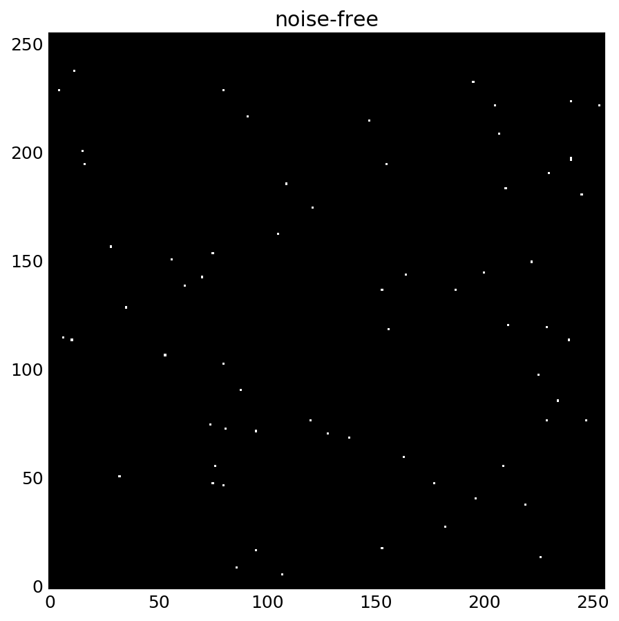

# Cytometry ratio analysis

Python program using Scikit-image (optionally, OpenCV) to simulate and
analyze whole-slide cytometry images

*whole slide noise-free forward model*

## Prereqs

The prereqs are installed with:

    pip install -e .

If there aren't .whl for your platform, it will try to compile the
modules, which could take hours on the Raspberry Pi. Better in that case
to do:

    sudo apt install python-numpy python-matplotlib python-skimage python-opencv

## Run Analysis

assuming your *.png images are in a directory `../data`:

    ./cclskim.py ../data

You can also specify a single file:

    ./cclskim.py ../data/mypic0.png

-e suffix of filenames to look for [default .png] -o write all plots
to a directory instead of showing on screen

## Run Forward Model

A simple method of simulated whole-slide images:

    ./fwdmodel.py
